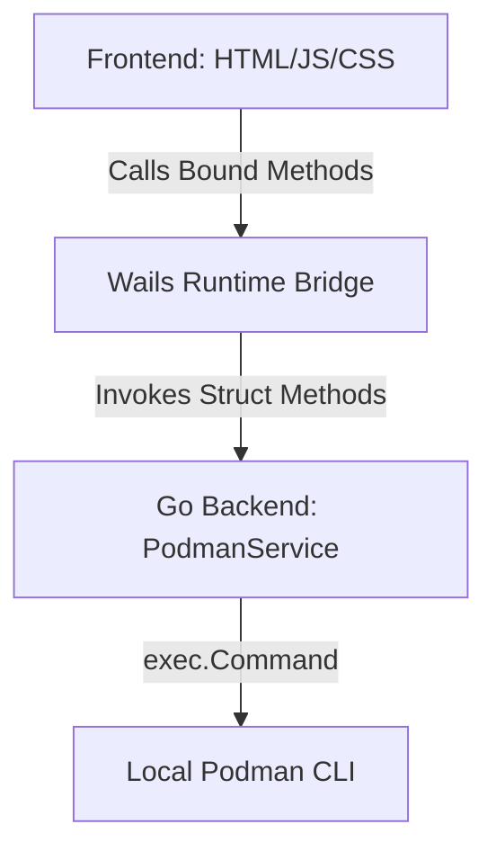

# Project Context & Architecture

This document tracks the high-level architecture and key design decisions (ADRs) for **Podder**.

## Architecture Overview
Podder is a lightweight GUI client for Podman container management. It is built using **Wails v3**, a framework for writing desktop applications with Go and web technologies.

---

## Architectural Decision Records (ADRs)

### ADR 1: Direct CLI Invocation vs. Socket API Connection
* **Context**: We need to query container/image states and trigger start/stop/restart events. This can be done by connecting to the podman UNIX socket (`/run/user/1000/podman/podman.sock`) or by executing the `podman` CLI commands directly.
* **Decision**: We use direct execution of the local `podman` CLI with the `--format json` flag.
* **Consequences & Benefits**:
  - Requires zero system configuration. Rootless Podman sockets are not enabled by default, so CLI execution is immediately ready for any user.
  - Avoids dependencies on the Docker/Podman Go SDKs, which are heavy and have frequent API versioning breaks.
  - Highly secure because we execute commands using the raw `exec.Command` slice syntax (e.g. `exec.Command("podman", "start", id)`), avoiding shell expansions (`sh -c`) and preventing shell injection vulnerabilities.

### ADR 2: Vanilla Tech Stack in Wails Frontend
* **Context**: Web development guidelines specify using HTML, JavaScript, and Vanilla CSS to ensure maximum performance, flexibility, and lightweight bundle sizes.
* **Decision**: We avoid heavy frontend framework bundles (such as React or Vue) and Tailwind CSS, choosing pure HTML5, modern CSS variables, and Vanilla JS.
* **Consequences & Benefits**:
  - Zero compilation overhead for JS files, leading to extremely fast Vite build times (~0.5s).
  - Pinned memory overhead to a minimal footprint.
  - Custom styling allows beautiful glassmorphic visual designs and animations without the burden of utility library defaults.

### ADR 3: Asynchronous Operations and Polling
* **Context**: Container commands (like pulling images or starting containers) can block for significant periods.
* **Decision**:
  - We use standard Go synchronous calls, but the Wails frontend calls them asynchronously (via JS promises).
  - We use a spinner animation on the active buttons to signal loading states.
  - We auto-refresh stats and container lists every 5 seconds, and container logs every 3 seconds when the logs modal is open.

### ADR 4: Compose Launches Perform A Podman Socket Preflight
* **Context**: `podman compose` can depend on the user-scoped Docker-compatible Podman API socket (`podman.sock`). On many rootless systems that socket is not started by default, which causes first-run compose failures even though Podman itself is installed correctly.
* **Decision**:
  - Podder prefers Podman-native compose execution over plain `docker-compose` when both are available.
  - Before running a compose provider that needs the Podman API socket, Podder checks whether the socket exists and attempts `systemctl --user start podman.socket` if it does not.
  - Podder does not auto-enable lingering or mutate user systemd state from package install scripts.
* **Consequences & Benefits**:
  - Common first-run compose failures are fixed at launch time without requiring users to understand Podman socket internals.
  - The package install remains conservative and does not guess which desktop user should own persistent user services.
  - Systems without a valid user systemd session still fail clearly, with an actionable manual command.
