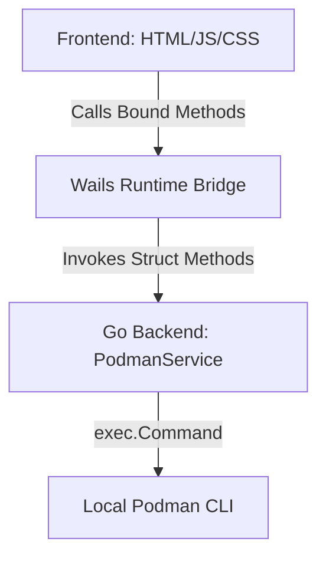

# Project Context & Architecture

This document tracks the high-level architecture and key design decisions (ADRs) for **Podder**.

## Architecture Overview
Podder is a lightweight GUI client for Podman container management. It is built using **Wails v3**, a framework for writing desktop applications with Go and web technologies.

```mermaid
graph TD
    A[Frontend: HTML/JS/CSS] -- Calls Bound Methods --> B[Wails Runtime Bridge]
    B -- Invokes Struct Methods --> C[Go Backend: PodmanService]
    C -- exec.Command --> D[Local Podman CLI]
```

---

## Architectural Decision Records (ADRs)

### ADR 1: Direct CLI Invocation vs. Socket API Connection
* **Context**: We need to query container/image states and trigger start/stop/restart events. This can be done by connecting to the podman UNIX socket (`/run/user/1000/podman/podman.sock`) or by executing the `podman` CLI commands directly.
* **Decision**: We use direct execution of the local `podman` CLI with the `--format json` flag.
* **Consequences & Benefits**:
  - Requires zero system configuration. Rootless Podman sockets are not enabled by default, so CLI execution is immediately ready for any user.
  - Avoids dependencies on the Docker/Podman Go SDKs, which are heavy and have frequent API versioning breaks.
  - Highly secure because we execute commands using the raw `exec.Command` slice syntax (e.g. `exec.Command("podman", "start", id)`), avoiding shell expansions (`sh -c`) and preventing shell injection vulnerabilities.

### ADR 2: Vanilla Tech Stack in Wails Frontend
* **Context**: Web development guidelines specify using HTML, JavaScript, and Vanilla CSS to ensure maximum performance, flexibility, and lightweight bundle sizes.
* **Decision**: We avoid heavy frontend framework bundles (such as React or Vue) and Tailwind CSS, choosing pure HTML5, modern CSS variables, and Vanilla JS.
* **Consequences & Benefits**:
  - Zero compilation overhead for JS files, leading to extremely fast Vite build times (~0.5s).
  - Pinned memory overhead to a minimal footprint.
  - Custom styling allows beautiful glassmorphic visual designs and animations without the burden of utility library defaults.

### ADR 3: Asynchronous Operations and Polling
* **Context**: Container commands (like pulling images or starting containers) can block for significant periods.
* **Decision**:
  - We use standard Go synchronous calls, but the Wails frontend calls them asynchronously (via JS promises).
  - We use a spinner animation on the active buttons to signal loading states.
  - We auto-refresh stats and container lists every 5 seconds, and container logs every 3 seconds when the logs modal is open.

### ADR 4: Compose Launches Perform A Podman Socket Preflight
* **Context**: `podman compose` can depend on the user-scoped Docker-compatible Podman API socket (`podman.sock`). On many rootless systems that socket is not started by default, which causes first-run compose failures even though Podman itself is installed correctly.
* **Decision**:
  - Podder prefers Podman-native compose execution over plain `docker-compose` when both are available.
  - Before running a compose provider that needs the Podman API socket, Podder checks whether the socket exists and attempts `systemctl --user start podman.socket` if it does not.
  - Podder does not auto-enable lingering or mutate user systemd state from package install scripts.
* **Consequences & Benefits**:
  - Common first-run compose failures are fixed at launch time without requiring users to understand Podman socket internals.
  - The package install remains conservative and does not guess which desktop user should own persistent user services.
  - Systems without a valid user systemd session still fail clearly, with an actionable manual command.

### ADR 5: Filesystem-Backed Container Workflows Use Native Pickers
* **Context**: Host bind mounts are error-prone when users must type absolute filesystem paths manually, especially for long folder paths or single asset files such as images.
* **Decision**:
  - Podder uses Wails native file dialogs to select host folders and host image files for bind mounts.
  - The Run Container workflow keeps the image name field text-based, but treats host content selection as an explicit native-picker action.
  - The Containers view exposes the active filter state clearly so dashboard navigation into running/stopped subsets is obvious.
* **Consequences & Benefits**:
  - Users can mount host content without copying filesystem paths manually.
  - The bind-mount flow remains local and secure because Podder validates and passes paths directly to `podman` without shell interpolation.
  - Filtered dashboard navigation behaves more like a focused drill-down than a blind tab switch.

### ADR 6: Declared-Endpoint Equality Is Separate From Conflict Detection (v1.4)
* **Context**: Two different questions were being answered by the same normalization function. "Can these two bind addresses collide if both try to listen" (conflict/allocation safety) legitimately treats an omitted host bind, `0.0.0.0`, and `*` as interchangeable "wildcard" — but "are these two declarations/configurations exactly the same" (mutation verification, `DeploySpec` verification, registry reconciliation) must NOT make that same collapse, or a verification step can silently accept a runtime configuration that doesn't actually match what was declared.
* **Decision**:
  - `AddressesConflict`/`EndpointsConflict` (via `NormalizeAddress`) remain the conservative, deliberately-loose conflict/allocation-safety comparison. Unchanged.
  - `CanonicalDeclaredBind`/`DeclaredEndpointsEquivalent` are a new, separate EXACT declared-endpoint comparison that keeps an omitted bind, an explicit IPv4/IPv6 wildcard, IPv4/IPv6 loopback, and any specific address mutually distinct. `portMappingSetEqual` (managed-create verification, port-mutation PREFLIGHT/VERIFY, `DeploySpec` verification) and `EndpointsEquivalentForReconciliation` (registry reconciliation) both key on this, not on `NormalizeAddress`.
  - Whether Podman's own `inspect`/`ps` JSON actually preserves the omitted-vs-`0.0.0.0` distinction end-to-end is a real-runtime fact this architectural split does not itself prove — that is explicitly deferred to the dedicated rootless-Podman integration campaign.
* **Consequences & Benefits**:
  - A mutation/deploy/create verification step can no longer silently treat "the operator declared no host bind" and "the operator declared an explicit wildcard" as the same known-good configuration.
  - Conflict detection stays conservative (overblocking is preferred to underblocking) without contaminating the stricter equality question, and vice versa.

### ADR 7: Provenance Metadata Is a Discovery Hint, Not Filesystem Authorization (v1.4)
* **Context**: Compose/Quadlet auto-discovery (working directory, config-file list, systemd unit name) is sourced from container labels — data any container, including a malicious or malformed one, can set. Treating it as an authoritative path to open is a path-traversal / arbitrary-file-read risk (`../../etc/passwd`-style label values).
* **Decision**:
  - `resolveWithinRoot` (`pathtrust.go`) is the shared containment check: every candidate path derived from provenance metadata is joined against, and proven to remain within, an allowed root — syntactically (clean + prefix check) and, for a path that exists, physically (symlink-resolved), so an in-tree symlink can't be used to defeat containment.
  - `validateQuadletUnitIdentifier` rejects any Quadlet unit identifier that isn't a plain, safe basename (no `/`, `\`, `..`, absolute paths, NUL, or characters outside a conservative systemd-unit charset) before any candidate path is even built.
  - An absolute Compose config-file path that resolves outside the container's reported working directory is treated as unresolved provenance (`ErrComposeFileOutsideWorkingDir`) and never read, rather than trusted because a label claims it is authoritative.
* **Consequences & Benefits**:
  - A malicious or malformed container's labels can no longer make Podder read an arbitrary file the process can access.
  - Normal, well-formed Compose/Quadlet discovery is unaffected — only out-of-root/invalid-identifier cases are refused.
